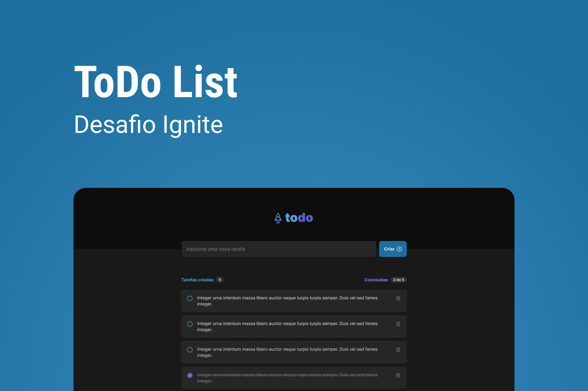

  <h1 align="center">
	  todo-list app 🚀
  </h1>
  <!-- <h5 align="left">
	  🚀 todo-list is an to-do list application.
  </h5> -->
  <!-- <h5 align="left">
	  This application was a Rocketseat Bootcamp challenge.
  </h5> -->
  <!-- <h5 align="left">
	  As a developer I can never stop learning, I added some new functionallities to take
    the application to the next level, 
    like edit todo, responsiveness, saving on localStorage.
  </h5> -->

# Tabela de conteúdos

<!--ts-->

- [About](#about)
- [Final application](#application)
  <!-- - [Requirements](#requirements) -->
- [Tecnologies](#technologies)
- [Features](#features)
<!--te-->

## Getting Started

  <h2>This application is being built using the following technologies:</h2>
  
  - [ReactJS](https://reactjs.org/docs/getting-started.html)
  - [TypeScript](https://www.typescriptlang.org/)
  - [React-icons](https://react-icons.github.io/react-icons/)
  - [ViteJS](https://vitejs.dev/)
  - [Radix](https://www.radix-ui.com/docs/primitives/overview/getting-started)
  - [TailwindCSS](https://tailwindcss.com/docs/installation)
  <!-- - [Firebase](https://tailwindcss.com/docs/installation) -->
  <!-- - [Redux]()]-->

  <h2>Features</h2>
  
    - [x] Create a to-do
    - [x] Edit a to-do
    - [x] Delete a to-do
    - [x] Update a to-do as completed
    - [x] Update a to-do as incompleted
    - [x] Responsiveness
    - [x] Integration com Firebase
    - [ ] Redux

<!-- 

  <h2>Aprendizados</h2>

    - light e dark mode com styled-components
    - persistir informaçoes no localStorage
    - utlizar o hook useReducer
    - criar um contexto para compartilhar informações pela aplicação
    - testes E2E com cypress

 -->

  <h2>You can see the final application here: </h2>
  
  - [todo-list app](https://cllg1-todo-list22.vercel.app/)

  <h2>Autor</h2>

 
  
 <b>Flavio Santos</b>

Built with ❤️ by Flavio Santos 👋🏽 get in touch!

